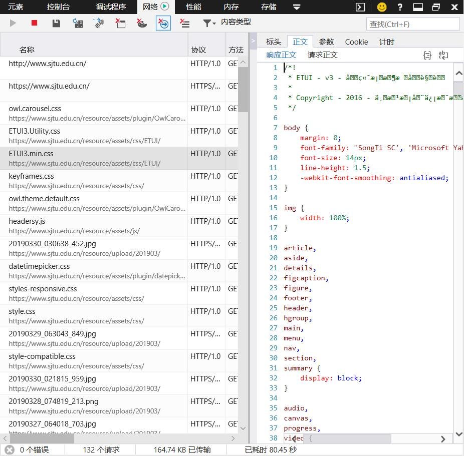
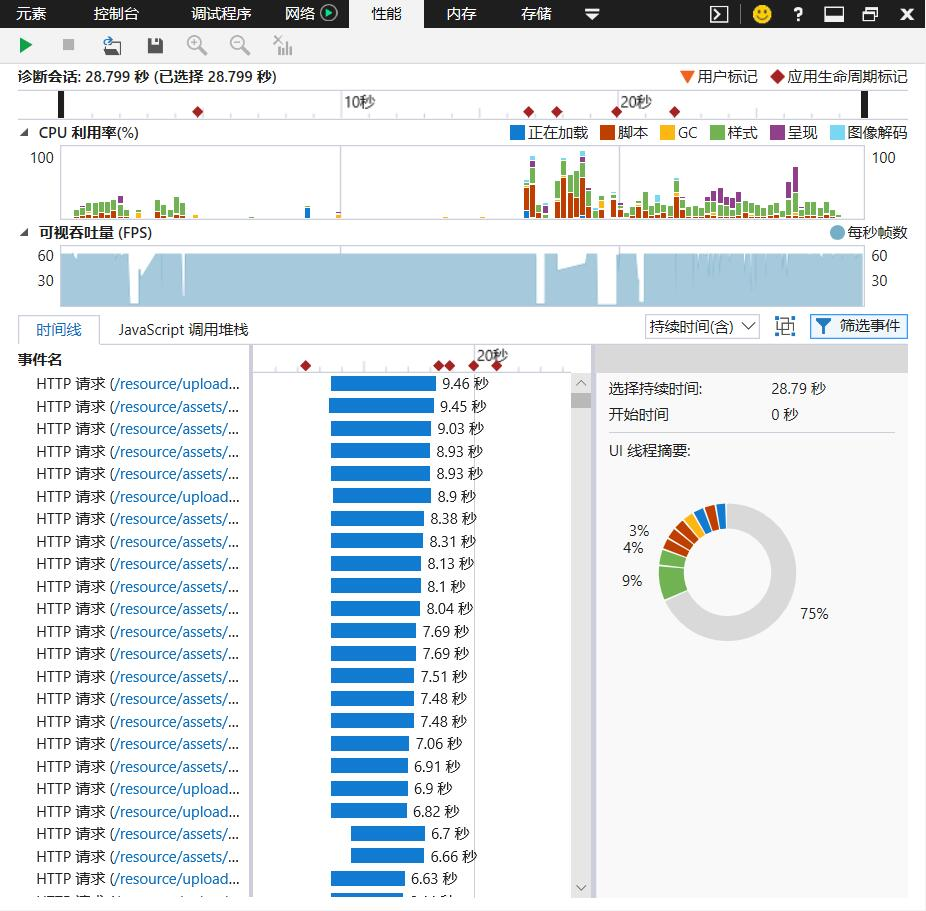

# Analysis of the Home Page of SJTU Using Developer Tools 

## Device Mode
Using Device Mode, I can approximate how my page looks and performs on a mobile device by setting values to width and height.

### Responsive Layout
The home page of SJTU has a responsive layout, which can adapt to a variety of devices with different sreen resolutions. There is no need to write a page for mobile devices specifically.

## Elements
The html file of the page is exposed here. I can view and change the DOM and CSS.

### Unremoved Comments
The page has a lot of comments. I think they are quite necessary in the development environment, but useless in the production environment. The users will never see them. They don't interfere with the display and the interactions at all. Worst of all, they slow down the loading of the page.

## Console
I can view messages and run JavaScript here! I love ``console.log()``!

### DOM Element Number
By running ``document.getElementsByTagName('*').length``, I find the total number of the DOM elements of the page is 1696. Maybe too many?

## Sources
All related files of the page are displayed. I can debug JavaScript code here.

## Network
I can view view and debug network activity here.

### Uncompressed js and css Files
I find a lot of loaded files are not compressed, as is shown in the picture. This slows down the loading of the page.

## Performance
I can find ways to improve load and runtime performance here

### Too many HTTP requests
The performance analysis shows that too many HTTP requests slow down the loading of the page. Too many js files, css files and picutres are loaded as soon as the page is opened. Some of the files can be merged into one. The picures can be set to load when the user scrolls to the specific position of the page.