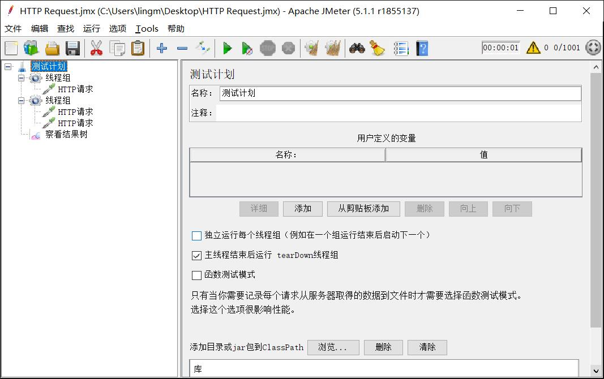
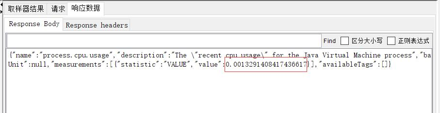
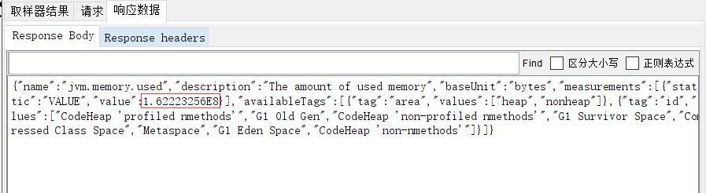
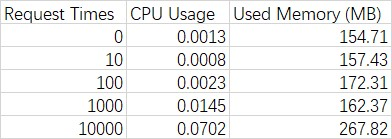

# Resources Consumption

## Equipments

1. Spring Boot Actuator to get used memory and CPU usage
2. JMeter to send requests

## Process

The first Thread Group is used to send GET request to `/greeting`, which simply returns `"hello"`, many times in one second.

The second Thread Group is used to get Actuator information from `/actuator/metrics/jvm.memory.used` and `/actuator/metrics/process.cpu.usage`, which only runs once after one second.

So I am testing the resources consumption after getting many requests.

## Results

These two pictures show the consumption information I got when no requests have been sent.

I make a table which shows the whole result.

